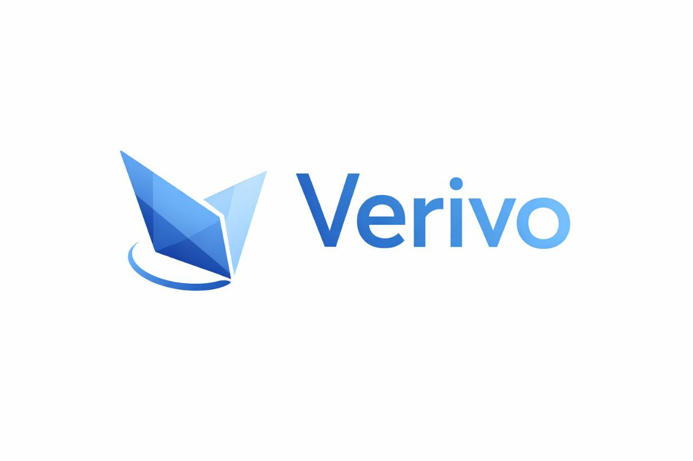

# Verivo

**Solution de vote sécurisée pour entreprises, associations et institutions**



---

## Résumé Projet

Verivo est une solution de vote électronique sécurisée visant à garantir :
- ✅ **Inviolabilité** : Aucun vote ne peut être modifié ou supprimé après emission
- ✅ **Audibilité** : Tout électeur peut vérifier que son vote a été comptabilisé
- ✅ **Anonymat** : Impossible de relier un vote à un électeur spécifique
- ✅ **Accessibilité** : Interface simple, intuitive, accessible à tous

---

## Équipe

| Rôle | Nom |
|------|-----|
| Lead Blockchain | Etienne Wallet |
| Lead UX/UI | Solène Mallié |
| Lead Développeur | Arnaud Calvo |
| Développeur | Clément Conand |
| Lead Produit | Philippe Mbongue |

---

## Workflow Utilisateur

```
┌─────────────────────────────────────────────────────────────────────────────┐
│                              INSCRIPTION                                    │
│  ┌──────────────┐     ┌──────────────┐     ┌──────────────┐               │
│  │ Page         │     │ Formulaire   │     │ Génération   │               │
│  │ Inscription  │ ──► │ + Validation │ ──► │ Wallet       │               │
│  │              │     │ Email        │     │              │               │
│  └──────────────┘     └──────────────┘     └──────────────┘               │
└─────────────────────────────────────────────────────────────────────────────┘
                                       │
                                       ▼
┌─────────────────────────────────────────────────────────────────────────────┐
│                         CRÉATION SCRUTIN                                    │
│  ┌──────────────┐     ┌──────────────┐     ┌──────────────┐               │
│  │ Paramétrage  │     │ Sélection     │     │ Hash registre│               │
│  │ Scruntin     │ ──► │ Votants       │ ──► │ + Mint NFT   │               │
│  │              │     │              │     │              │               │
│  └──────────────┘     └──────────────┘     └──────────────┘               │
└─────────────────────────────────────────────────────────────────────────────┘
                                       │
                                       ▼
┌─────────────────────────────────────────────────────────────────────────────┐
│                           INVITATION                                        │
│  ┌──────────────┐     ┌──────────────┐     ┌──────────────┐               │
│  │ Email        │     │ Notification │     │ Accès        │               │
│  │ Notification │ ──► │ Push         │ ──► │ Scrutin      │               │
│  │              │     │              │     │              │               │
│  └──────────────┘     └──────────────┘     └──────────────┘               │
└─────────────────────────────────────────────────────────────────────────────┘
                                       │
                                       ▼
┌─────────────────────────────────────────────────────────────────────────────┐
│                              VOTE                                           │
│  ┌──────────────┐     ┌──────────────┐     ┌──────────────┐               │
│  │ Connexion    │     │ Selection    │     │ Confirmation │               │
│  │ + Auth       │ ──► │ Vote         │ ──► │ + Preuve     │               │
│  │              │     │              │     │              │               │
│  └──────────────┘     └──────────────┘     └──────────────┘               │
└─────────────────────────────────────────────────────────────────────────────┘
                                       │
                                       ▼
┌─────────────────────────────────────────────────────────────────────────────┐
│                         RÉSULTATS                                           │
│  ┌──────────────┐     ┌──────────────┐     ┌──────────────┐               │
│  │ Clôture      │     │ Calcul       │     │ Publication  │               │
│  │ Auto/Manuelle│ ──►│ Résultats    │ ──►│ + Preuve     │               │
│  │              │     │              │     │              │               │
│  └──────────────┘     └──────────────┘     └──────────────┘               │
└─────────────────────────────────────────────────────────────────────────────┘
```

---

## Cycle de vie d'un scrutin

```
[Brouillon] ──► [Ouvert] ──► [Clos] ──► [Dépouillé] ──► [Archivé]
     │              │             │              │              │
     │         [100% vote]   [Fin durée]   [Calcul]      [Archive]
     │              │             │              │              │
     └──────────────┴─────────────┴──────────────┴──────────────┘
```

---

## Fonctionnalités Clés

### Accès au scrutin
- ✅ Seuls les personnes ayant le droit de vote peuvent voir le scrutin
- ✅ Le registre des personnes pouvant voter est mis à jour quand le NFT est envoyé

### Règles de scrutin
- **Type** : Majorité simple à 1 tour
- **Durée** : Choix par l'organisateur
- **Clôture** : Quand tout le monde a votés OU à la fin du temps défini
- **Irrevocable** : On ne peut pas modifier son vote

---

## Business Model

### Contrainte légale (France)
- Les fédérations sportives devront avoir **50% de participation minimum** aux scrutins
- Vérifiable sur blockchain
- **Grosse opportunité business**

---

## Informations Projet

- **Date de début** : 23-02-2026
- **Statut** : En cours de définition du périmètre
- **Certification** : En perspective avec Alyra

---

## License

À définir...
